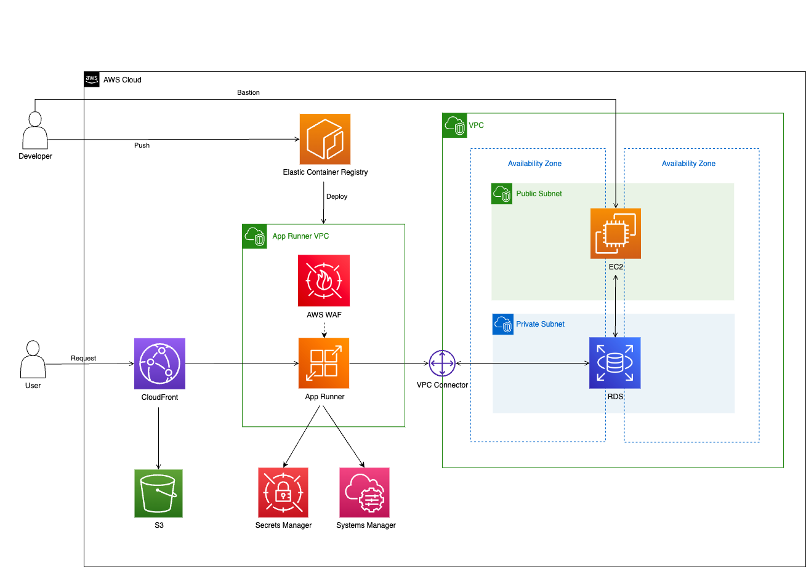

# App Runner 

This is a sample project for deploying App Runner service with AWS CDK.



## How To Deploy

1. Create a new secret for initializing database in AWS Secrets Manager.

   ```json
   username: <DB_USER_NAME>
   password: <DB_PASSWORD>
   ```

2. Create a new secret paramater store in AWS Systems Manager.  

3. Add new environment variables to the `cdk.context.json` file.

4. Run the following command to deploy service.

   ```bash
   $ cdk diff "*" -c env=<ENV> -c commit=<COMMIT_HASH>
   $ cdk deploy "*" -c env=<ENV> -c commit=<COMMIT_HASH> --require-approval never
   ```

After deploying, you can access the App Runner service from the default domain name.
